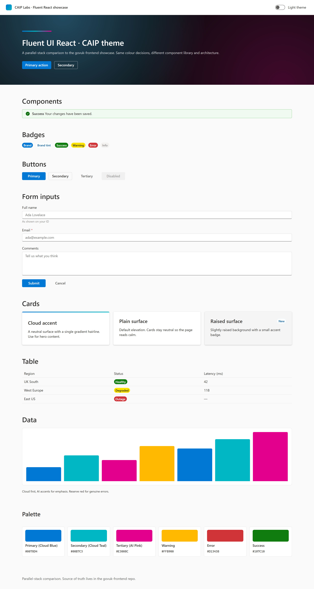
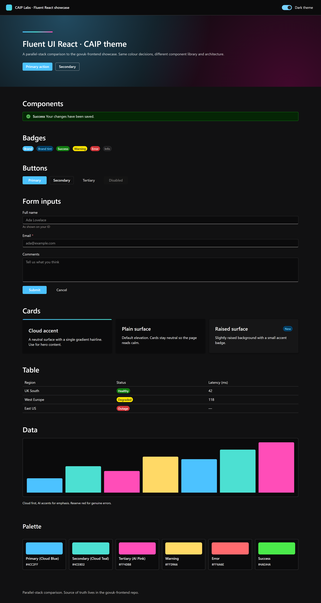

# Fluent showcase

A small Vite + React + Fluent UI React v9 app that demonstrates `@lestermarch/caip-fluentui-theme` with light / dark toggle and the usual showcase sections (hero, buttons, badges, cards, table, chart, palette).

| Light | Dark |
|---|---|
|  |  |

## Run

```bash
npm install
npm run dev
```

Open the printed URL.

## How the theme is wired in

```tsx
import { FluentProvider } from "@fluentui/react-components";
import { caipLightTheme, caipDarkTheme } from "@lestermarch/caip-fluentui-theme";

<FluentProvider theme={dark ? caipDarkTheme : caipLightTheme}>
  {/* app */}
</FluentProvider>
```

That's the whole integration. Everything else in `src/App.tsx` is showcase chrome.

## Updating against local theme changes

This example consumes the published package by default. To test against unreleased local theme changes:

```bash
# from the theme repo root
npm run build
npm pack
# in examples/fluent-showcase
npm install ../../lestermarch-caip-fluentui-theme-<version>.tgz
```
